# AI Competitive Intelligence Observatory


[](https://doi.org/10.5281/zenodo.20581501)

**Démonstrateur IA pour équipes métiers : veille, synthèse stratégique, workflows LLM et validation humaine.**

Ce projet est une application Streamlit en français, conçue comme un cas pratique de formation professionnelle à l’IA générative appliquée aux métiers.

Il montre comment transformer des signaux de veille dispersés en briefing utile, vérifiable et actionnable grâce à l’IA générative, avec une étape explicite de validation humaine.

---

## Positionnement

Ce projet n’est pas un outil de recherche académique. C’est un démonstrateur métier.

Il sert à montrer, dans un contexte professionnel réaliste, comment une équipe peut utiliser l’IA pour :

- structurer des informations dispersées ;
- analyser des signaux de veille ;
- produire une synthèse exploitable ;
- identifier opportunités, risques et actions ;
- conserver la traçabilité des sources ;
- intégrer une validation humaine ;
- documenter les limites et responsabilités.

---

## Aperçu de l’application

L’application propose une démonstration complète du workflow : visualisation des signaux, analyse métier par LLM, génération de briefing, validation humaine et usage pédagogique.

### Page d’accueil et vue d’ensemble

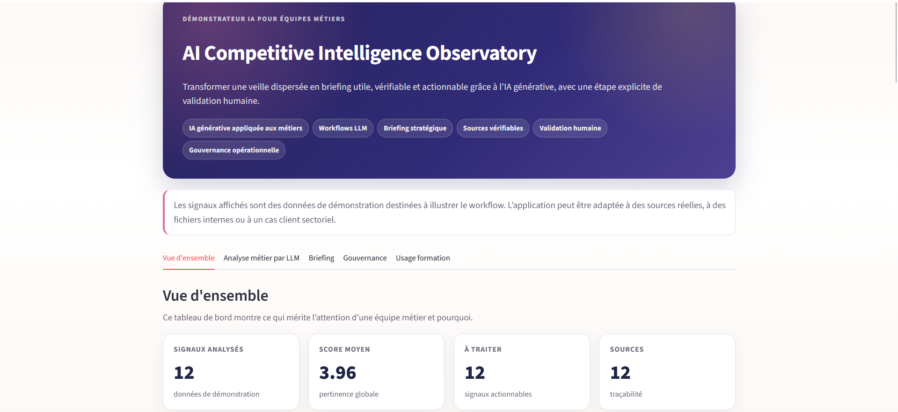

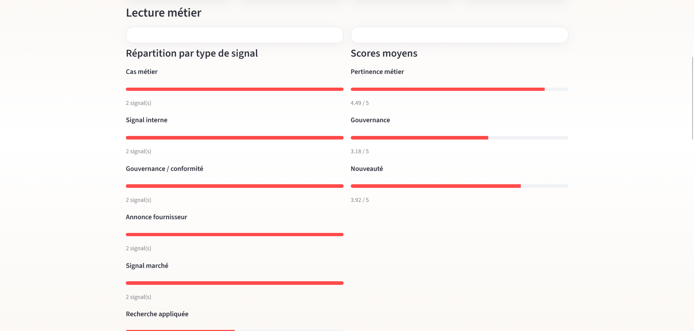

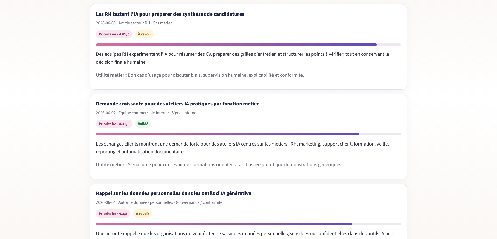

### Signaux à traiter et tendances détectées

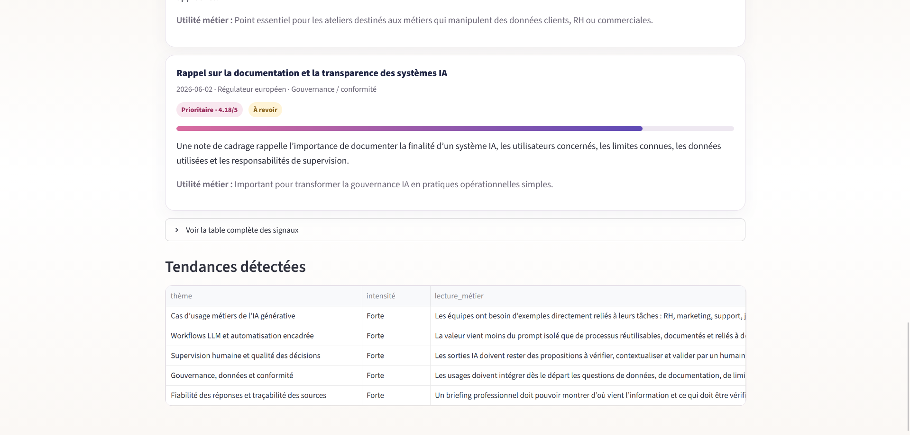

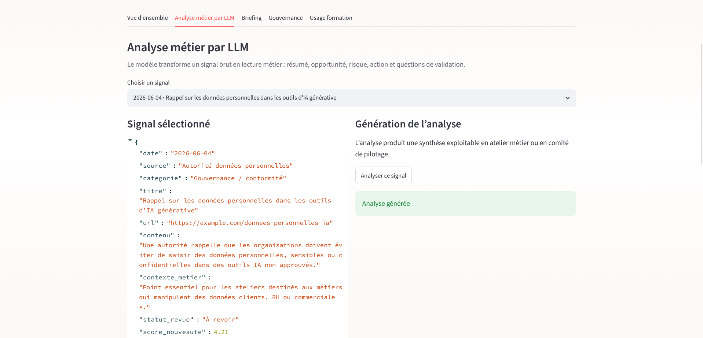

### Analyse métier par LLM

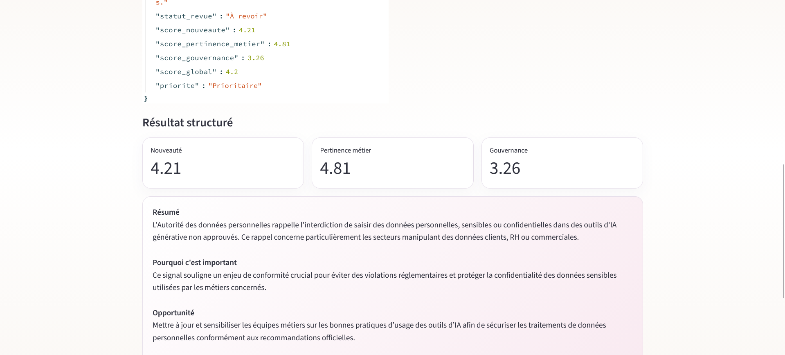

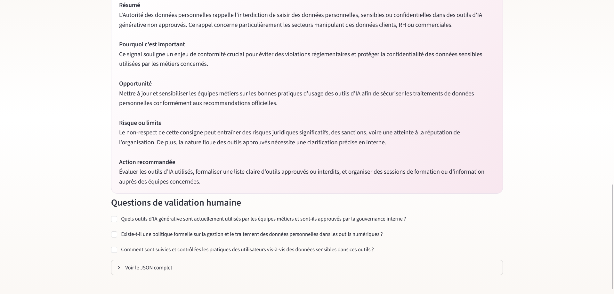

### Briefing stratégique

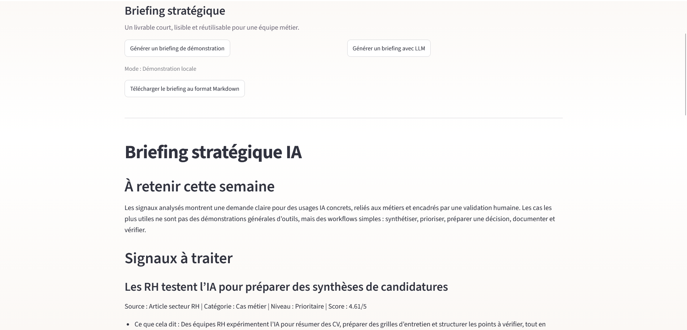

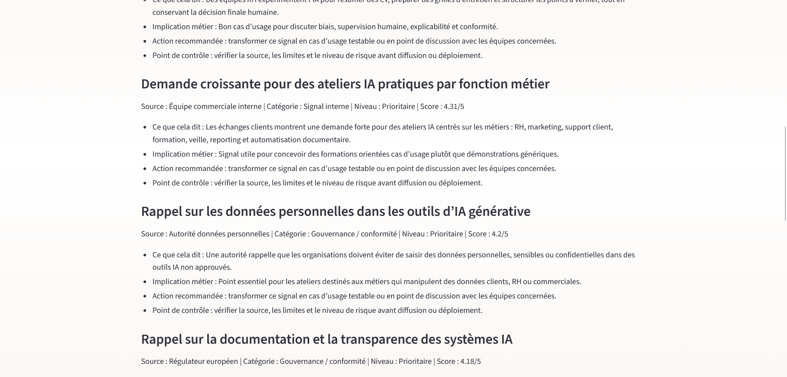

### Gouvernance et usage formation

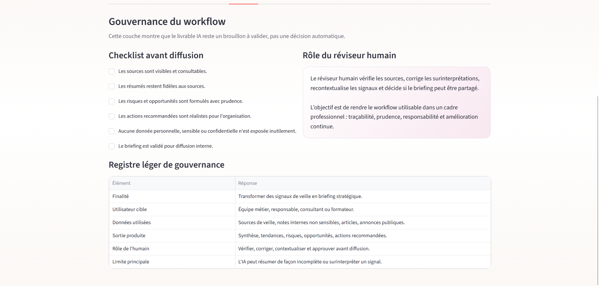

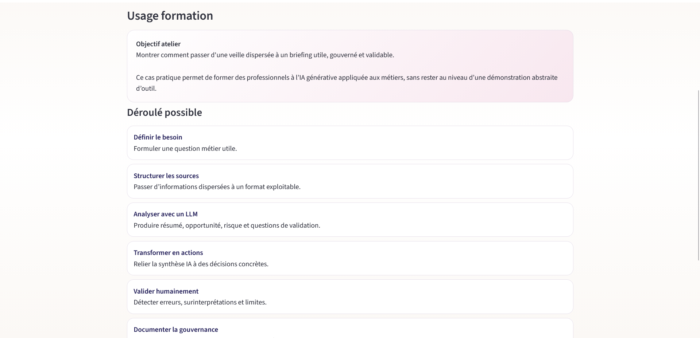

---

## Ce que fait l’application

L’application permet de :

- charger des signaux de veille depuis un CSV ;
- scorer les signaux selon leur nouveauté, leur pertinence métier et leur impact gouvernance ;
- visualiser les signaux à traiter ;
- détecter des tendances utiles pour une équipe métier ;
- analyser un signal avec OpenAI ;
- générer un briefing stratégique avec OpenAI ou avec un moteur local de démonstration ;
- télécharger le briefing en Markdown ;
- appliquer une checklist de validation humaine ;
- documenter un registre léger de gouvernance.

---

## Valeur pédagogique

Ce démonstrateur peut servir de support à un atelier sur :

- l’IA générative appliquée aux métiers ;
- les workflows LLM ;
- la synthèse stratégique ;
- le prompting orienté sortie structurée ;
- la traçabilité des sources ;
- la supervision humaine ;
- les limites des modèles ;
- la gouvernance opérationnelle de l’IA.

Il est construit autour d’une logique simple : partir d’un cas réel de travail, produire un livrable utile, puis questionner les limites et les responsabilités.

---

## Workflow

```text
Sources de veille métier
        ↓
Structuration des signaux
        ↓
Scoring nouveauté / pertinence / gouvernance
        ↓
Analyse LLM
        ↓
Briefing stratégique
        ↓
Validation humaine
        ↓
Diffusion interne
```

---

## Exemple de cas d’usage

Une équipe métier reçoit chaque semaine plusieurs sources d’information : articles, annonces d’éditeurs IA, signaux internes, notes réglementaires ou retours clients.

L’application aide à transformer ces éléments dispersés en briefing structuré :

- ce qu’il faut retenir ;
- pourquoi cela compte pour l’organisation ;
- quels risques ou limites encadrer ;
- quelles actions envisager ;
- quels points doivent être validés humainement.

---

## Architecture fonctionnelle

```text
CSV de signaux
   ↓
App Streamlit
   ↓
Scoring local
   ↓
Analyse LLM optionnelle
   ↓
Briefing Markdown
   ↓
Checklist de validation humaine
```

---

## Installation

```bash
python -m venv .venv
.venv\Scripts\python.exe -m pip install -r requirements.txt
```

Sur macOS/Linux :

```bash
python -m venv .venv
source .venv/bin/activate
pip install -r requirements.txt
```

---

## Configuration OpenAI

L’application fonctionne en mode démonstration sans clé API.

Pour activer OpenAI, vous pouvez saisir votre clé dans la barre latérale Streamlit ou créer un fichier :

```text
.streamlit/secrets.toml
```

avec :

```toml
OPENAI_API_KEY = "votre_clé_api"
```

Ne publiez jamais votre clé API sur GitHub.

---

## Lancer l’application

Sous Windows :

```bash
.venv\Scripts\python.exe -m streamlit run app\streamlit_app.py
```

Sur macOS/Linux :

```bash
streamlit run app/streamlit_app.py
```

---

## Format CSV attendu

Le CSV doit contenir les colonnes suivantes :

```text
date, source, categorie, titre, url, contenu, contexte_metier, statut_revue
```

Un fichier de démonstration est fourni dans :

```text
data/sample/signaux_veille_demo.csv
```

---

## Structure du projet

```text
ai-competitive-intelligence-observatory/
│
├── app/
│   ├── streamlit_app.py
│   ├── analyse.py
│   └── llm_openai.py
│
├── data/
│   └── sample/
│       └── signaux_veille_demo.csv
│
├── docs/
│   ├── cas_pedagogique.md
│   └── notes_gouvernance.md
│
├── images/
│   ├── image-1.png
│   ├── image-2.png
│   ├── image-3.png
│   ├── image-4.png
│   ├── image-5.png
│   ├── image-6.png
│   ├── image-7.png
│   ├── image-8.png
│   ├── image-9.png
│   ├── image-10.png
│   └── image-11.png
│
├── outputs/
│   └── briefing_demo.md
│
├── .streamlit/
│   └── config.toml
│
├── .env.example
├── requirements.txt
├── LICENSE
└── README.md
```

---

## Technologies utilisées

- Python
- Streamlit
- Pandas
- OpenAI API
- Markdown export
- CSV input
- Human-in-the-loop review pattern

---

## Note sur les données de démonstration

Les signaux fournis dans le CSV sont fictifs ou génériques. Ils servent à illustrer le workflow. L’application peut être adaptée à des sources réelles, des fichiers internes ou des cas sectoriels.

---

Ce projet démontre une capacité à concevoir un workflow IA professionnel, explicable et pédagogique :

- compréhension des besoins métiers ;
- intégration concrète d’un LLM ;
- structuration de l’information ;
- aide à la décision ;
- visualisation claire ;
- prise en compte des limites ;
- gouvernance et validation humaine.

Il présente une approche de formation fondée sur des cas concrets, manipulables et directement reliés aux usages professionnels.
